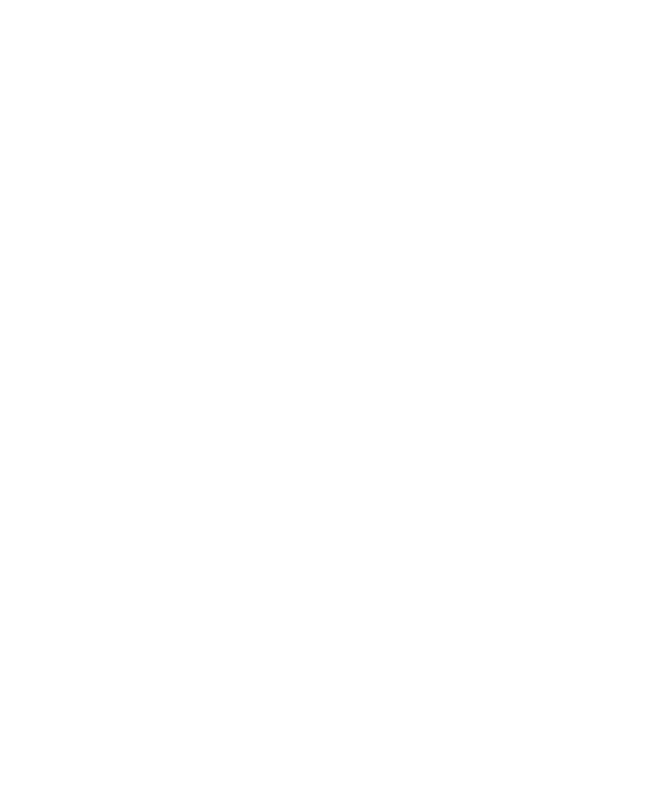
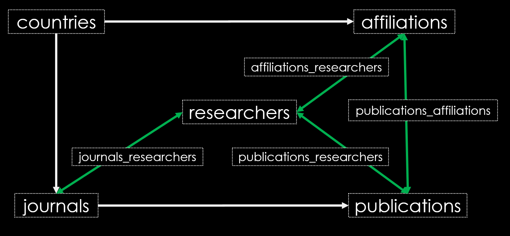

<!-- README -->
##### README
<!-- PROJECT LOGO -->

  <h1 align="center">neuropapers db</h1>
  
2010 - 2023 Neuroscience Scientific Publications  
    <a href="https://github.com/inesgcalvo/neuro_papers_db">
    <strong>Explore the documents »</strong></a>

<!-- TABLE OF CONTENTS -->

  
Table of Contents

  <ol><li><a href="#about-the-project">About The Project</a></li>
      <ul><li><a href="#description">Description</a></li></ul>    
      <li><a href="#extraction">Extraction</a></li>
      <li><a href="#transformation">Transformation</a></li>
      <li><a href="#loading">Loading</a></li>
      <li><a href="#visualization">Visualization</a></li>
      <li><a href="#modeling">Modeling</a></li>
      <li><a href="#contact">Contact</a></li>
      <li><a href="#requirements">Requirements</a></li>
      <li><a href="#acknowledgments">Acknowledgments</a></li></ol>

<!-- ABOUT THE PROJECT -->
## About The Project
This project involved the creation of a database of neuroscience publications. To achieve this, the first step was to gather information about journals with the highest impact factor in the field of neuroscience (SJR). Afterward, PubMed was scraped to retrieve all publications published in these journals between 2010 and 2023.
Subsequently, the data was enriched with geographical coordinates, links to journals, and other relevant information

  
Project Creation Summary

  <ol><h4>Data Extraction:</h4></ol>
    <ol><ol><h6>
    <a href="https://www.scimagojr.com/">SCImago</a> (SJR), <a href="https://www.oecd.org/">OECD</a> (© Organisation for Economic Co-operation and Development), <a href="https://pubmed.ncbi.nlm.nih.gov/">PubMed®</a>, <a href="https://www.topuniversities.com/v2">QS Top Universities</a>, <a href="https://www.wikipedia.org/">Wikipedia</a>, 
    <a href="https://genderize.io/">Geocoding</a> (Google Maps) and
    <a href="https://developers.google.com/maps/documentation/geocoding/start">genderize</a>. 
    </ol></ol></h6>
  <ol><h4>Data Transformation:</h4></ol>
    <ol><ol><h6>pandas, geopy, ...</h6></ol></ol>
  <ol><h4>Data Loading:</h4></ol>
    <ol><ol><h6>SQLAlchemy, MySQL, ...</h6></ol></ol>
  <ol><h4>Data Visualization:</h4></ol>
    <ol><ol><h6>Web application (<a href="https://github.com/inesgcalvo/neuro_papers_db/blob/main/src/server.py">streamlit</a>), <a href="https://public.tableau.com/app/profile/in.s.g.calvo/viz/universities_17014263435230/Universities">Tableau</a>, PowerBI, pylab, seaborn, folium, ...</h6></ol></ol>
  <ol><h4>ML Modeling:</h4></ol>
    <ol><ol><h6>Surprise, surprise, ...</h6></ol></ol>

 
  

 

(<a href="#readme">Back to top</a>)

 <!-- DESCRIPTION -->
## Description
The type of data collected from a scientific publication is illustrated in the following example and subsequently listed

 

- **Title:** Clear and concise, reflecting the content of the study.
- **Authors:** List of individuals responsible for the research.
- **Abstract:** A comprehensive summary of the main objectives, methodologies, findings, and implications of the study.
- **DOI (Digital Object Identifier):** For precise identification and referencing.
- **Journal:** Information about the journal of publication, including name, publication year, and month.
- **Volume:** Specific volume where the article can be found.
- **Publication Date:**
- **Pages:** Page numbers where the article can be found.

And other types of information as:

- **Affiliations:** Information about the affiliations of the authors.
- **PubMed ID (PMID):** Unique identifier for efficient retrieval in relevant databases.
- **ISSN:** International Standard Serial Number (ISSN) for electronic and linking formats.
  

(<a href="#readme">Back to top</a>)

<!-- EXTRACTION -->
## Extraction
For the creation of neuropapers database, a diverse range of sources has been utilized to ensure comprehensive and robust data compilation.

  <h4 align="left">Data Extraction Methods:  
    - Comma-Separated Values (.csv) archives from: <ol>
    <a href="https://www.scimagojr.com/">SCImago</a>,
    <a href="https://www.wikipedia.org/">Wikipedia</a>,
    <a href="https://www.topuniversities.com/v2">QS Top Universities</a> and <a href="https://www.oecd.org/">OECD</a>. </ol>
    - Web Scraping with selenium from: <ol>
  <a href="https://pubmed.ncbi.nlm.nih.gov/">PubMed</a> and 
  <a href="https://search.crossref.org/">Crossref</a> </ol>
    - API data extraction with requests from: <ol>
    <a href="https://genderize.io/">Geocoding</a> (Google Maps) and
    <a href="https://developers.google.com/maps/documentation/geocoding/start">genderize</a>. 
    </ol>
  </h4>

(<a href="#readme">Back to top</a>)

<!-- TRANSFORMATION -->
## Transformation
With **pandas**, data cleansing involved the process of detecting and rectifying any inconsistencies, inaccuracies, or anomalies within a dataset. Leveraging functionalities such as data filtering, handling missing values, and identifying outliers, data cleansing ensured the accuracy and reliability of the dataset.

Together with the data cleansing process, additional information was **enriched** in the dataset, including geographical coordinates of research centers. This enrichment enhances the dataset by providing supplementary details for a more comprehensive analysis.

(<a href="#readme">Back to top</a>)

<!-- LOADING -->
## Loading
Thanks to the powerful **SQLAlchemy** library, the relational SQL database was created, relationships between tables were established, and tables were filled. Finally, **MySQL** software was used to check the viability of the data. The database architecture adheres to the following schema.

 

(<a href="#readme">Back to top</a>)

<!-- VISUALIZATION -->
## Visualization
I performed data visualization using a variety of tools, ranging from Python libraries like **pylab** and **seaborn** to software such as **Tableau** and **MySQL**. Additionally, I utilized mapping libraries like **folium** and **pydeck** for the creation of maps. Not forgetting the development of a web application using **streamlit**.

  <h4 align="left">
    - Top Universities dashboad: <ol>
    <a href="https://public.tableau.com/app/profile/in.s.g.calvo/viz/universities_17014263435230/Universities">Tableau</a>. </ol>
    - neuropapers db publication's navigation dashboard: <ol>
  <a href="https://app.powerbi.com/links/pVO_KG2UPi?ctid=4380e7a1-c525-44fc-b9e4-a02e0dda4d80&pbi_source=linkShare&bookmarkGuid=502342b6-8416-40e5-bd1e-b3a0f98ffae5">PowerBI</a>. </ol>
  </h4>

(<a href="#readme">Back to top</a>)

<!-- MODELING -->
## Modeling
I have created a model to predict in which journal it is more likely to submit your publication given the title and abstract. To achieve this, I preprocessed data from titles and abstracts, converted them into tensors with `tensorflow`, and reduced their dimensionality. Finally, the data has been fed into various classification models. Among them, I ultimately chose to use `DecisionTreeClassifier()`.

 
  

 

(<a href="#readme">Back to top</a>)

<!-- CONTACT -->
## Contact

* [GitHub](https://github.com/inesgcalvo)
* [LinkedIn](https://www.linkedin.com/in/ines-g-calvo/)
* [Website](http://inesgcalvo.byethost31.com/)

(<a href="#readme">Back to top</a>)

<!-- REQUIREMENTS -->
## Requirements
Requirements from Ironhack Spain for the Final Project.

**Basic Knowledge:**
  -  Proficiency in Python
  -  Proficiency in Data Transformation

**Project Submission:**
  - [X]  README.md
  - [X]  Folder structure with all the necessary documentation for the project
  - [X]  Support material for the presentation

**Specific Criteria:**

Below is a table with 4 main sections. Each project must comply with the indication of at least 2 of the sections, as they fit each project:
  
  Extraction:
  - [X]  APIs
  - [X]  WebScraping
  - [X]  Automated file download
  - [ ]  Queries to Mongo
  - [ ]  Queries to SQL

  Loading:
  - [X]  Structured database creation (SQL) or Cloud creation
  - [ ]  Unstructured database creation (Mongo)
  - [ ]  API creation

  Visualization:
  - [X]  Use of at least one Python visualization library
  - [X]  Use of PowerBI or Tableau
  - [X]  Use of Streamlit or Flask

  Machine Learning:
  - [ ]  Use of ML models to infer a numerical value
  - [X]  Use of ML models to infer one or more categories
  - [ ]  Use of ML models for imputing null values

(<a href="#readme">Back to top</a>)

<!-- ACKNOWLEDGMENTS -->
## Acknowledgments
I am sincerely grateful for the support and guidance provided by my teachers: Yona, Carlos, JeanCha, Rosella, and Jaime. Their dedication to fostering an environment of learning and nurturing their students' intellectual growth has profoundly impacted my educational journey at [Ironhack](https://www.ironhack.com/es).

* 💡 [Yona](https://github.com/YonatanRA)
* 🏈 [Carlos](https://github.com/CharlyKill7)
* ⚡ [Jean-Cha](https://github.com/yamadajc)
* 🤖 [Rosella](https://github.com/rmanzi13)
* 😊 [Jaime](https://github.com/RCJaime)

(<a href="#readme">Back to top</a>)
